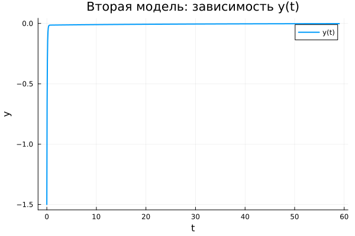

---
## Author
author:
  name: Гафоров Нурмухаммад
  email: 1032234484@rudn.ru
  affiliation:
    - name: Российский университет дружбы народов
      country: Российская Федерация
      postal-code: 117198
      city: Москва
      address: ул. Миклухо-Маклая, д. 6

## Title
title: "Математическое моделирование"
subtitle: "Лабораторная работа № 4"
license: "CC BY"
date: today
date-format: "YYYY-MM-DD"
---

# Вводная часть

## Цель работы

Рассмотреть математическую модель гармонического осциллятора и проанализировать её динамику в трёх режимах:

1. без учета потерь энергии;
2. при наличии затухания;
3. при действии внешнего воздействия.

## Задание

1. Получить решение уравнения осциллятора без затухания.
2. Сформулировать уравнение затухающего движения и исследовать его.
3. Построить фазовые траектории для затухающего случая.
4. Учесть влияние внешней силы в уравнении движения.
5. Построить решение и фазовый портрет для вынужденных колебаний.

# Теоретические сведения

## Гармонический осциллятор

Линейный гармонический осциллятор применяется для описания широкого круга процессов в различных областях науки.

Общее уравнение:

$$
\ddot{x} + 2\gamma \dot{x} + \omega_0^2 x = F(t)
$$

где:

- $x$ — переменная состояния;
- $\gamma$ — коэффициент диссипации;
- $\omega_0$ — собственная частота;
- $F(t)$ — внешнее воздействие.

## Система без затухания

При отсутствии потерь энергии:

$$
\ddot{x} + \omega_0^2 x = 0
$$

Движение носит периодический характер, энергия сохраняется.

## Система с затуханием

С учётом потерь энергии:

$$
\ddot{x} + 2\gamma \dot{x} + \omega_0^2 x = 0
$$

Амплитуда уменьшается со временем, система стремится к равновесию.

## Система с внешним воздействием

При наличии внешней силы:

$$
\ddot{x} + 2\gamma \dot{x} + \omega_0^2 x = F(t)
$$

Внешнее воздействие формирует устойчивые вынужденные колебания.

# Приведение к системе первого порядка

## Без затухания

$$
\begin{cases}
\dot{x} = y \\
\dot{y} = -\omega_0^2 x
\end{cases}
$$

## С затуханием

$$
\begin{cases}
\dot{x} = y \\
\dot{y} = -2\gamma y - \omega_0^2 x
\end{cases}
$$

## С внешней силой

$$
\begin{cases}
\dot{x} = y \\
\dot{y} = F(t) - 2\gamma y - \omega_0^2 x
\end{cases}
$$

## Начальные условия

Используемые значения:

$$
x_0 = 0.5, \qquad y_0 = -1.5
$$

Интервал времени:

$$
t \in [0; 59]
$$

Шаг:

$$
h = 0.05
$$

# Постановка задачи

## Модель 1

$$
\ddot{x} + 5.2x = 0
$$

## Модель 2

$$
\ddot{x} + 14\dot{x} + 0.5x = 0
$$

## Модель 3

$$
\ddot{x} + 13\dot{x} + 0.3x = 0.8\sin(9t)
$$

# Базовые эксперименты

## Первая модель: решение

## Первая модель: фазовый портрет

## Первая модель: анализ

Наблюдается устойчивый колебательный процесс без уменьшения амплитуды.

Характерные признаки:

- амплитуда остаётся постоянной;
- сигнал периодичен;
- энергия не рассеивается;
- фазовая траектория замкнута.

Модель описывает идеальные гармонические колебания.

## Вторая модель: решение

## Вторая модель: фазовый портрет

## Вторая модель: анализ

Колебания быстро исчезают и система переходит к равновесию.

Особенности:

- резкое уменьшение амплитуды;
- быстрый переходный процесс;
- траектория стремится к точке покоя;
- движение прекращается.

Модель демонстрирует затухающий режим.

## Третья модель: решение

## Третья модель: фазовый портрет

## Третья модель: анализ

После переходного процесса формируются устойчивые колебания малой амплитуды.

Наблюдается:

- наличие установившегося режима;
- отсутствие полного затухания;
- влияние внешней силы;
- компактная фазовая область.

Система переходит к вынужденным колебаниям.

# Параметрическое исследование

## Траектории $x(t)$

## Анализ

Результаты показывают:

- изменение частоты в первой модели;
- влияние на скорость затухания во второй;
- изменение режима в третьей.

Общие закономерности:

- сохранение колебаний;
- стремление к покою;
- формирование устойчивого режима.

## Траектории $y(t)$

## Анализ

Для $y(t)$ наблюдается аналогичное поведение:

- устойчивые колебания;
- быстрое затухание;
- вынужденные колебания.

# Анализ вычислений

## Время выполнения

## Интерпретация

Получено:

- минимальное время для первой модели;
- увеличение времени для второй;
- максимальные затраты для третьей.

Во всех случаях вычисления остаются эффективными.

# Итоговая метрика

## Определение

$$
\text{norm\_final} = \sqrt{x(t_{final})^2 + y(t_{final})^2}
$$

## График

## Интерпретация

Результаты:

- первая модель: значение существенно;
- вторая: близко к нулю;
- третья: мало, но отлично от нуля.

Метрика отражает различие режимов движения.

# Итоги

## Выводы

1. Незатухающая система сохраняет периодические колебания.
2. Затухание приводит к стабилизации системы.
3. Внешнее воздействие формирует устойчивые вынужденные колебания.
4. Параметры существенно изменяют динамику.
5. Численные методы позволяют эффективно исследовать систему.
6. Метрика $\text{norm\_final}$ подтверждает характер движения.
