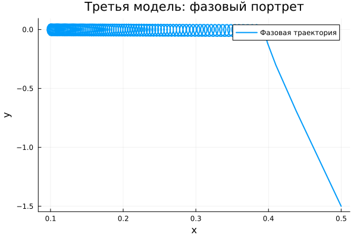

---
## Author
author:
  name: Гафоров Нурмухаммад
  email: 1032234484@rudn.ru
  affiliation:
    - name: Российский университет дружбы народов
      country: Российская Федерация
      postal-code: 117198
      city: Москва
      address: ул. Миклухо-Маклая, д. 6

## Title
title: "Математическое моделирование"
subtitle: "Лабораторная работа № 4"
license: "CC BY"
---

# Цель работы

Исследовать математическую модель гармонического осциллятора и проанализировать её поведение в различных условиях.

# Задание

1. Получить и визуализировать решение уравнения гармонического осциллятора без затухания  
2. Записать и исследовать уравнение затухающего осциллятора, включая фазовый портрет  
3. Рассмотреть случай воздействия внешней силы, построить решение и фазовый портрет  

# Выполнение лабораторной работы

## Теоретические сведения

Ряд физических процессов — колебания груза на пружине, движение маятника, процессы в электрических цепях — можно описать единым дифференциальным уравнением. Это уравнение лежит в основе модели линейного гармонического осциллятора.

Общее уравнение движения имеет вид:

$$\ddot{x} + 2\gamma \dot{x} + \omega_0^2 x = 0$$

где $x$ — координата системы, $\gamma$ — коэффициент затухания, $\omega_0$ — собственная частота.

Данное уравнение относится к линейным дифференциальным уравнениям второго порядка и описывает динамику системы.

Если потери энергии отсутствуют ($\gamma = 0$), уравнение принимает форму:

$$\ddot{x} + \omega_0^2 x = 0$$

Для получения единственного решения необходимо задать начальные условия:

$$
\begin{cases}
x(t_0) = x_0 \\
\dot{x}(t_0) = y_0
\end{cases}
$$

Перепишем уравнение в виде системы:

$$
\begin{cases}
\dot{x} = y \\
\dot{y} = -\omega_0^2 x
\end{cases}
$$

Начальные условия:

$$
\begin{cases}
x(t_0) = x_0 \\
y(t_0) = y_0
\end{cases}
$$

Переменные $x$ и $y$ формируют фазовое пространство. Каждое решение системы соответствует траектории на фазовой плоскости. Совокупность таких траекторий образует фазовый портрет, отражающий общее поведение системы.

## Задача

Необходимо построить решения и фазовые портреты для следующих моделей:

1. Без затухания и внешней силы  
   $$\ddot{x} + 5.2x = 0$$

2. С затуханием без внешнего воздействия  
   $$\ddot{x} + 14\dot{x} + 0.5x = 0$$

3. С затуханием и внешней силой  
   $$\ddot{x} + 13\dot{x} + 0.3x = 0.8\sin(9t)$$

Параметры моделирования:  
$t \in [0; 59]$, шаг $0.05$, $x_0 = 0.5$, $y_0 = -1.5$

### Преобразование моделей

1. Без затухания:

$$
\begin{cases}
\dot{x} = y \\
\dot{y} = -\omega_0^2 x
\end{cases}
$$

2. С затуханием:

$$
\begin{cases}
\dot{x} = y \\
\dot{y} = -2\gamma y - \omega_0^2 x
\end{cases}
$$

3. С внешней силой:

$$
\begin{cases}
\dot{x} = y \\
\dot{y} = F(t) - 2\gamma y - \omega_0^2 x
\end{cases}
$$

Для численного моделирования применялись внешние программные модули:





## Базовые эксперименты

### Первая модель (model_type = model1)

График $y(t)$ демонстрирует устойчивые периодические колебания с неизменной амплитудой. Форма сигнала остаётся регулярной на всём интервале времени.

Такое поведение характерно для консервативной системы, в которой отсутствуют потери энергии. Колебания не затухают и сохраняют свою структуру.

Фазовый портрет представляет собой замкнутую кривую, что указывает на повторяемость движения и устойчивость динамики.

Следовательно, система реализует идеальные гармонические колебания без диссипации.

### Вторая модель (model_type = model2)

На графике видно, что колебания быстро исчезают: переменная стремится к нулю уже на начальном участке.

Это обусловлено наличием демпфирования, которое приводит к рассеянию энергии. В результате система переходит в состояние равновесия.

Фазовая траектория стремится к неподвижной точке, что подтверждает затухающий характер процесса.

Таким образом, движение носит апериодический характер и быстро стабилизируется.

### Третья модель (model_type = model3)

В данном случае после переходного процесса устанавливаются устойчивые колебания небольшой амплитуды.

Несмотря на затухание, внешняя сила поддерживает движение, формируя вынужденные колебания.

Фазовый портрет ограничен небольшой областью около равновесия, что отражает установившийся режим.

Таким образом, система приходит к стационарным вынужденным колебаниям.

## Параметрическое сканирование

### Траектории $x(t)$

Исследование показало:

- в первой модели параметр влияет на частоту колебаний  
- во второй — на скорость затухания  
- в третьей — на характеристики вынужденного режима  

Общие выводы:

- первая модель сохраняет колебания  
- вторая — стремится к покою  
- третья — формирует устойчивый режим  

### Траектории $y(t)$

Поведение переменной $y(t)$ подтверждает предыдущие выводы:

- устойчивые колебания без затухания  
- быстрое затухание  
- установившиеся вынужденные колебания  

## Время вычислений

Анализ показал:

- первая модель вычисляется быстрее всего  
- вторая требует немного больше времени  
- третья наиболее ресурсоёмкая  

Тем не менее, вычисления во всех случаях выполняются быстро.

## Анализ метрики

Рассматривается величина:

$$
\text{norm\_final} = \sqrt{x(t_{final})^2 + y(t_{final})^2}
$$

Результаты:

- первая модель: значение остаётся значительным  
- вторая: стремится к нулю  
- третья: мало, но не ноль  

# Выводы

1. Незатухающая модель демонстрирует устойчивые гармонические колебания  
2. Наличие затухания приводит к переходу системы в состояние покоя  
3. Внешняя сила формирует устойчивые вынужденные колебания  
4. Параметры существенно влияют на динамику системы  
5. Численное моделирование эффективно для всех случаев  
6. Метрика $\text{norm\_final}$ отражает различие режимов  

# Список литературы {.unnumbered}

1. [Гармонический осциллятор](https://ru.wikipedia.org/wiki/Гармонический_осциллятор)  
2. [Модели колебательных систем](https://www.numamo.org/HTML/Articles/Oscillator.html)
