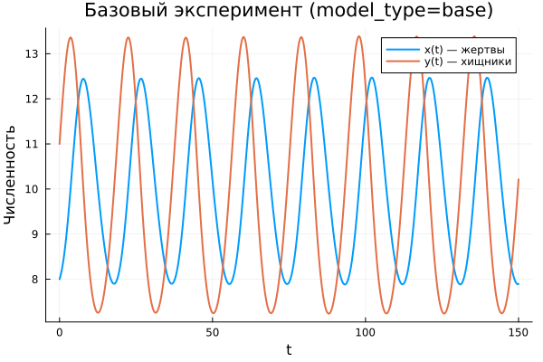
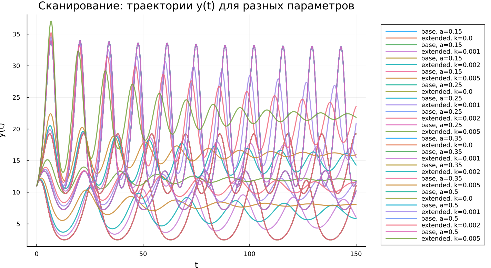

---
## Author
author:
  name: Гафоров Нурмухаммад
  email: 1032234484@rudn.ru
  affiliation:
    - name: Российский университет дружбы народов
      country: Российская Федерация
      postal-code: 117198
      city: Москва
      address: ул. Миклухо-Маклая, д. 6

## Title
title: "Математическое моделирование"
subtitle: "Лабораторная работа № 5"
license: "CC BY"
date: today
date-format: "YYYY-MM-DD"
---

# Вводная часть

## Цель работы

Проанализировать модель «хищник–жертва» и сравнить её поведение в классической и модифицированной постановках.

## Задание

1. Исследовать зависимость между численностями популяций.
2. Построить временные графики $x(t)$ и $y(t)$.
3. Определить состояние равновесия.
4. Сопоставить свойства базовой и расширенной моделей.
5. Провести анализ влияния параметров.

# Теоретические сведения

## Модель хищник-жертва

Рассматривается система Лотки–Вольтерры, описывающая взаимодействие двух видов.

Обозначим:

- $x(t)$ — численность хищников;
- $y(t)$ — численность жертв.

Тогда динамика системы задаётся уравнениями:

$$
\begin{cases}
\frac{dx}{dt} = -a x(t) + b x(t)y(t), \\
\frac{dy}{dt} = c y(t) - d x(t)y(t).
\end{cases}
$$

## Интерпретация параметров

Коэффициенты модели имеют следующий смысл:

- $a$ — интенсивность убыли хищников;
- $b$ — прирост хищников за счёт взаимодействия;
- $c$ — естественный рост жертв;
- $d$ — уменьшение численности жертв.

Изменение параметров приводит к изменению характера траекторий системы.

## Стационарное состояние

Состояние равновесия определяется из условий:

$$
\frac{dx}{dt}=0, \qquad \frac{dy}{dt}=0
$$

При положительных значениях переменных получаем:

$$
x_0=\frac{a}{b}, \qquad y_0=\frac{c}{d}
$$

Эта точка соответствует неизменному состоянию системы.

# Постановка задачи

## Исследуемая система

Рассматривается система:

$$
\begin{cases}
\frac{dx}{dt} = -0.25x(t) + 0.025x(t)y(t), \\
\frac{dy}{dt} = 0.45y(t) - 0.045x(t)y(t).
\end{cases}
$$

## Начальные условия

Начальные значения:

$$
x_0 = 8, \qquad y_0 = 11
$$

## Стационарное состояние

Подставляя параметры, получаем:

$$
x_0 = \frac{0.25}{0.025} = 10, \qquad y_0 = \frac{0.45}{0.045} = 10
$$

Таким образом, равновесие системы соответствует точке:

$$
(10, 10)
$$

# Базовые эксперименты

## Базовая модель: временные зависимости

## Базовая модель: фазовый портрет

## Базовая модель: анализ

Классическая модель демонстрирует устойчивые циклические изменения.

Ключевые особенности:

- переменные изменяются периодически;
- амплитуда практически не меняется со временем;
- система не стремится к равновесию;
- фазовая траектория образует замкнутую линию.

Это соответствует незатухающим автоколебаниям.

## Расширенная модель: временные зависимости

## Расширенная модель: фазовый портрет

## Расширенная модель: анализ

В модифицированной модели поведение меняется.

Основные наблюдения:

- начальные колебания имеют большую амплитуду;
- затем происходит постепенное затухание;
- система стремится к устойчивому состоянию;
- фазовая траектория имеет спиральную форму.

Добавление нелинейного члена ограничивает рост популяции и стабилизирует динамику.

# Параметрическое исследование

## Сканирование траекторий $x(t)$

## Анализ траекторий $x(t)$

Рассмотрено влияние параметров:

- в базовой модели варьируется $a$;
- в расширенной модели изменяется $k$.

Выводы:

- в базовой модели сохраняется периодический режим;
- параметры влияют на форму колебаний;
- в расширенной модели увеличения $k$ ускоряет затухание;
- система быстрее достигает равновесия.

## Сканирование траекторий $y(t)$

## Анализ траекторий $y(t)$

Поведение переменной аналогично:

- базовая модель сохраняет циклическую динамику;
- расширенная демонстрирует снижение амплитуды;
- усиление нелинейного эффекта ускоряет стабилизацию.

## Фазовые траектории

## Анализ фазовых траекторий

Сравнение показывает:

- базовая модель — замкнутые орбиты;
- расширенная — сходящиеся спирали;
- первая сохраняет колебания;
- вторая стремится к равновесию.

# Анализ итоговой метрики

## Метрика norm_final

Используется показатель:

$$
\text{norm\_final} = \sqrt{x(t_{final})^2 + y(t_{final})^2}
$$

## Зависимость norm_final от параметра

## Интерпретация результата

Результаты показывают:

- в базовой модели значение остаётся большим из-за отсутствия затухания;
- в расширенной модели значение определяется положением равновесия;
- система после переходного процесса стабилизируется.

# Анализ вычислений

## Время вычислений

## Интерпретация времени

Численные расчёты показывают:

- высокая скорость вычислений;
- слабая зависимость от параметров;
- добавление нелинейности не увеличивает существенно время;
- метод интегрирования остаётся эффективным.

# Итоги

## Выводы

1. Базовая модель демонстрирует устойчивые периодические колебания.
2. Расширенная модель приводит к затухающей динамике.
3. Фазовые портреты различаются по типу траекторий.
4. Параметры влияют на характеристики движения.
5. Метрика $\text{norm\_final}$ отражает тип режима.
6. Численные методы обеспечивают высокую эффективность.
