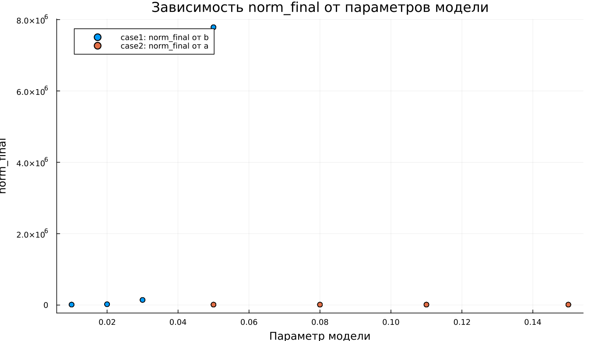

---
author:
  name: Гафоров Нурмухаммад
  email: 1032234484@rudn.ru
  affiliation:
    - name: Российский университет дружбы народов
      country: Российская Федерация
      city: Москва
title: "Математическое моделирование"
subtitle: "Лабораторная работа № 6"
license: "CC BY"
date: today
date-format: "YYYY-MM-DD"
---

# Вводная часть

## Цель работы

Рассмотреть эпидемиологическую модель $SIR$ и исследовать, как изменяется распространение заболевания во времени.

## Задание

1. Изучить модель эпидемии.
2. Построить графики изменения численности групп $S(t)$, $I(t)$ и $R(t)$.
3. Проанализировать два режима:
   - $I(0) \leq I^*$;
   - $I(0) > I^*$.
4. Выполнить параметрическое исследование.
5. Сравнить полученные модели по графикам и метрикам.

# Теоретические сведения

## Модель $SIR$

В модели $SIR$ вся популяция делится на три основные группы:

- $S(t)$ — восприимчивые к заболеванию особи;
- $I(t)$ — инфицированные особи;
- $R(t)$ — выздоровевшие особи, получившие иммунитет.

Общая численность популяции задаётся выражением:

$$
N = S(t) + I(t) + R(t).
$$

## Логика переходов

Модель описывает последовательное перемещение особей между группами:

$$
S \rightarrow I \rightarrow R.
$$

Сначала восприимчивые особи заражаются и переходят в группу $I$. Затем инфицированные со временем выздоравливают и переходят в группу $R$.

## Условие изоляции

Пока число заболевших не превышает критический уровень $I^*$, будем считать, что инфицированные изолированы.

Если выполняется условие

$$
I(t) \leq I^*,
$$

то новые заражения отсутствуют.

Если же

$$
I(t) > I^*,
$$

то инфицированные начинают заражать восприимчивых особей.

## Уравнение для $S(t)$

Скорость изменения числа восприимчивых определяется следующим образом:

$$
\frac{dS}{dt} =
\begin{cases}
-\alpha S, & I(t) > I^*, \\
0, & I(t) \leq I^*.
\end{cases}
$$

## Уравнение для $I(t)$

Динамика числа инфицированных описывается уравнением:

$$
\frac{dI}{dt} =
\begin{cases}
\alpha S - \beta I, & I(t) > I^*, \\
-\beta I, & I(t) \leq I^*.
\end{cases}
$$

## Уравнение для $R(t)$

Число выздоровевших изменяется по закону:

$$
\frac{dR}{dt} = \beta I.
$$

Параметры модели имеют следующий смысл:

- $\alpha$ — коэффициент заражения;
- $\beta$ — коэффициент выздоровления.

# Постановка задачи

## Исходные данные

Рассматривается эпидемия, возникшая на острове.

Известно:

$$
N = 11400,
$$

$$
I(0) = 250,
$$

$$
R(0) = 47.
$$

## Начальное число восприимчивых

Количество восприимчивых особей в начальный момент времени вычисляется по формуле:

$$
S(0) = N - I(0) - R(0).
$$

После подстановки числовых значений получаем:

$$
S(0) = 11400 - 250 - 47 = 11103.
$$

## Рассматриваемые режимы

В работе анализируются два возможных случая:

1. $I(0) \leq I^*$ — начальное число инфицированных не превышает критический порог.
2. $I(0) > I^*$ — начальное число инфицированных больше критического порога.

# Базовые эксперименты

## Первая модель: временные зависимости

## Первая модель: фазовый портрет

## Анализ первой модели

Для первой модели наблюдается нестандартная динамика:

- $S(t)$ остаётся неизменной величиной;
- $I(t)$ возрастает по экспоненциальному закону;
- $R(t)$ уменьшается и может принимать отрицательные значения;
- в системе отсутствует механизм, ограничивающий рост инфицированных.

## Вывод по первой модели

Первая модель не согласуется с физическим смыслом классической $SIR$-системы.

Ключевая особенность состоит в том, что

$$
S(t) = const.
$$

Из-за этого число восприимчивых не уменьшается, а количество инфицированных продолжает расти без стабилизации.

# Вторая модель

## Вторая модель: временные зависимости

## Вторая модель: фазовый портрет

## Анализ второй модели

Во второй модели проявляется типичная эпидемическая динамика:

- $S(t)$ монотонно уменьшается;
- $I(t)$ сначала растёт;
- затем $I(t)$ достигает максимума и начинает снижаться;
- $R(t)$ монотонно увеличивается.

## Интерпретация второй модели

На начальном этапе инфекция распространяется наиболее активно.

Позже число восприимчивых уменьшается, поэтому скорость заражения падает. В результате эпидемический процесс постепенно затухает:

$$
I(t) \rightarrow 0.
$$

# Сравнение базовых моделей

## Качественное различие

| Характеристика | Первая модель | Вторая модель |
|---|---|---|
| $S(t)$ | остаётся постоянным | убывает |
| $I(t)$ | растёт без ограничения | имеет конечный максимум |
| $R(t)$ | может становиться отрицательным | возрастает |
| Фазовый портрет | вертикальная траектория | незамкнутая кривая |
| Физический смысл | нарушается | сохраняется |

# Параметрическое исследование

## Сканирование траекторий $S(t)$

## Анализ траекторий $S(t)$

Для первой модели:

- $S(t)$ не меняется;
- изменение параметров почти не влияет на восприимчивую группу.

Для второй модели:

- $S(t)$ убывает;
- при увеличении параметра $a$ уменьшение происходит быстрее.

## Сканирование траекторий $I(t)$

## Анализ траекторий $I(t)$

Первая модель:

- показывает экспоненциальный рост $I(t)$;
- при увеличении параметра $b$ рост становится более быстрым.

Вторая модель:

- описывает эпидемическую волну;
- $I(t)$ достигает пика, после чего уменьшается.

## Сканирование траекторий $R(t)$

## Анализ траекторий $R(t)$

Первая модель:

- приводит к некорректным значениям $R(t)$;
- допускает появление отрицательных значений.

Вторая модель:

- отражает накопление выздоровевших;
- $R(t)$ стремится к конечному уровню.

## Фазовые траектории

## Анализ фазовых траекторий

Фазовые портреты показывают различие моделей:

- в первой модели траектории вырождаются в вертикальные линии;
- во второй модели траектории имеют форму, характерную для $SIR$-процесса;
- сначала $I$ растёт при уменьшении $S$;
- затем $I$ начинает снижаться.

# Анализ итоговых метрик

## Метрика $norm\_final$

Рассматривалась метрика:

$$
\text{norm\_final} =
\sqrt{
S(t_{final})^2 +
I(t_{final})^2 +
R(t_{final})^2
}.
$$

Она используется для оценки состояния системы в конце моделирования.

## Зависимость $norm\_final$ от параметра

## Интерпретация $norm\_final$

Для первой модели:

- метрика быстро увеличивается;
- основная причина — экспоненциальный рост $I(t)$.

Для второй модели:

- значения метрики ниже;
- система приближается к стационарному состоянию.

# Максимум инфицированных

## Зависимость $I_{max}$ от параметра

## Анализ $I_{max}$

Первая модель:

- даёт чрезмерно большие значения $I_{max}$;
- рост числа инфицированных не ограничивается.

Вторая модель:

- имеет конечный максимум;
- пик зависит от параметра $a$;
- при большем $a$ максимум достигается раньше.

# Анализ вычислений

## Время вычислений

## Интерпретация времени вычислений

Бенчмаркинг показал:

- обе модели численно решаются быстро;
- время вычислений имеет порядок $10^{-4}$ секунды;
- изменение параметров почти не влияет на вычислительные затраты;
- выбранный численный метод работает эффективно.

# Итоги

## Основные результаты

1. Первая модель показывает нефизичное поведение.
2. В первой модели число инфицированных растёт без ограничения.
3. Вторая модель описывает реалистичную эпидемическую волну.
4. Во второй модели эпидемия затухает, а $I(t) \to 0$.
5. Фазовые портреты подтверждают качественное различие моделей.

## Выводы

1. Модель case1 не подходит для корректного описания эпидемического процесса.
2. Модель case2 соответствует классической логике $SIR$-модели.
3. Параметры $a$ и $b$ заметно влияют на скорость распространения инфекции.
4. Метрики $\text{norm\_final}$ и $I_{max}$ позволяют количественно сравнивать модели.
5. Численное решение обеих систем выполняется эффективно.

# Список литературы {.unnumbered}

1. [Конструирование эпидемиологических моделей](https://habr.com/ru/post/551682/)
2. [Зараза, гостья наша](https://nplus1.ru/material/2019/12/26/epidemic-math)
