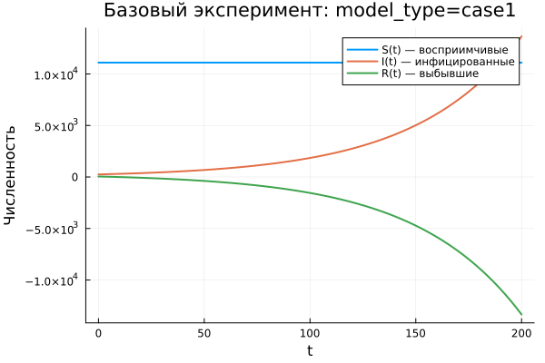

---  
## Author
author:
  name: Гафоров Нурмухаммад
  email: 1032234484@rudn.ru
  affiliation:
    - name: Российский университет дружбы народов
      country: Российская Федерация
      postal-code: 117198
      city: Москва
      address: ул. Миклухо-Маклая, д. 6

## Title
title: "Математическое моделирование"
subtitle: "Лабораторная работа № 6"
license: "CC BY"
---

# Цель работы

Исследовать эпидемиологическую модель $SIR$ и проанализировать особенности её динамики.

# Задание

1. Изучить математическую модель распространения эпидемии.
2. Построить графики изменения количества особей в трёх группах. Проанализировать течение эпидемии для двух случаев: $I(0)\leq I^*$ и $I(0)>I^*$.

# Выполнение лабораторной работы

## Теоретические сведения

Рассмотрим простейшую модель эпидемического процесса. Пусть имеется изолированная популяция численностью $N$. В рамках модели всё население делится на три группы.

Первая группа включает восприимчивых к заболеванию, но ещё не инфицированных особей. Их количество обозначается через $S(t)$. Вторая группа состоит из инфицированных особей, которые являются носителями и распространителями инфекции. Их число обозначается через $I(t)$. Третья группа описывает особей, которые уже выздоровели и приобрели иммунитет к заболеванию. Эта величина обозначается через $R(t)$.

До тех пор пока число инфицированных не превышает критический уровень $I^*$, будем считать, что больные изолированы и не заражают восприимчивых особей. Если же выполняется условие $I(t)>I^*$, то инфицированные начинают распространять заболевание среди здоровых восприимчивых особей.

Следовательно, изменение числа восприимчивых описывается системой:

$$
\frac{dS}{dt}=
 \begin{cases}
	-\alpha S, &\text{если $I(t) > I^*$},\\
	0, &\text{если $I(t) \leq I^*$}.
 \end{cases}
$$

Поскольку каждая восприимчивая особь после заражения переходит в группу инфицированных, скорость изменения $I(t)$ определяется разностью между числом новых заражённых и числом инфицированных, которые выздоравливают:

$$
\frac{dI}{dt}=
 \begin{cases}
	\alpha S-\beta I, &\text{если $I(t) > I^*$},\\
	-\beta I, &\text{если $I(t) \leq I^*$}.
 \end{cases}
$$

Количество выздоровевших особей изменяется по закону:

$$
\frac{dR}{dt} = \beta I.
$$

Здесь $\alpha$ — коэффициент заражения, а $\beta$ — коэффициент выздоровления. Для однозначного определения решения необходимо задать начальные условия. В начальный момент времени $t=0$ задаются значения $S(0)$, $I(0)$ и $R(0)$. Для исследования поведения модели требуется рассмотреть два режима: $I(0)\leq I^*$ и $I(0)>I^*$.

### Задача

На острове началась эпидемия. Известно, что общая численность населения составляет $N=11400$. В момент начала наблюдения, то есть при $t=0$, число заболевших и распространяющих инфекцию людей равно $I(0)=250$. Количество людей, уже имеющих иммунитет к заболеванию, равно $R(0)=47$.

Тогда начальное число восприимчивых к болезни, но пока здоровых людей определяется выражением:

$$
S(0)=N-I(0)-R(0).
$$

Необходимо построить графики изменения численности групп $S(t)$, $I(t)$ и $R(t)$, а также рассмотреть два варианта развития эпидемии:

1. $I(0)\leq I^*$;
2. $I(0)>I^*$.

Для численного моделирования и построения графиков использовались внешние файлы с программным кодом:





## Базовые эксперименты

### Первая модель (model_type = case1)

В первой модели система демонстрирует нетипичную динамику. Число восприимчивых особей $S(t)$ не изменяется со временем, что полностью соответствует уравнению $dS/dt=0$. При этом число инфицированных $I(t)$ быстро возрастает по экспоненциальному закону, а величина $R(t)$ уменьшается и со временем принимает отрицательные значения.

Такой результат нельзя считать физически корректным для классической эпидемиологической модели. Основная причина состоит в том, что в системе отсутствует механизм, ограничивающий рост числа инфицированных. Кроме того, переменная $R(t)$ теряет свой эпидемиологический смысл, поскольку число выздоровевших не может быть отрицательным.

Фазовый портрет подтверждает это наблюдение. Поскольку $S(t)$ остаётся постоянной величиной, траектория практически превращается в вертикальную линию. Фактически изменение происходит только по координате $I$, поэтому двумерная динамика системы вырождается.

Таким образом, первая модель приводит к неограниченному росту числа инфицированных и не описывает реалистичный процесс распространения заболевания.

### Вторая модель (model_type = case2)

Во второй модели наблюдается поведение, характерное для классической $SIR$-системы. Количество восприимчивых $S(t)$ постепенно уменьшается, что отражает процесс заражения. Число инфицированных $I(t)$ сначала возрастает, затем достигает максимального значения, после чего начинает убывать и стремится к нулю. Величина $R(t)$, наоборот, монотонно увеличивается.

Такое поведение хорошо согласуется с логикой эпидемического процесса в замкнутой популяции. В начале эпидемии инфекция активно распространяется, так как число восприимчивых велико. Затем, по мере уменьшения $S(t)$, скорость заражения снижается, и эпидемия постепенно затухает.

Фазовая траектория имеет вид незамкнутой кривой. Сначала она поднимается вверх, что соответствует росту $I(t)$ при уменьшении $S(t)$. Затем траектория плавно опускается, отражая спад числа инфицированных после прохождения пика.

В отличие от первой модели, здесь система стремится к устойчивому предельному состоянию: $I(t)\to 0$, $S(t)$ выходит на остаточный уровень, а $R(t)$ достигает конечного значения.

## Параметрическое сканирование

### Траектории $S(t)$ для различных параметров

Сравнение траекторий $S(t)$ показывает, что модели по-разному реагируют на изменение параметров. В первой модели (case1) значение $S(t)$ остаётся неизменным для всех рассмотренных параметров. Это связано с тем, что в данном режиме выполняется уравнение $dS/dt=0$. Следовательно, изменение коэффициентов не оказывает влияния на число восприимчивых особей.

Во второй модели (case2) величина $S(t)$ убывает. Причём скорость убывания заметно зависит от параметра $a$. При увеличении $a$ восприимчивые особи переходят в другие группы быстрее, что соответствует более интенсивному заражению.

Основные результаты:

- в первой модели значение $S(t)$ остаётся постоянным;
- во второй модели число восприимчивых монотонно уменьшается;
- параметр $a$ определяет интенсивность уменьшения группы $S$.

### Траектории $I(t)$ для различных параметров

Для первой модели во всех экспериментах наблюдается экспоненциальный рост $I(t)$. При увеличении параметра $b$ скорость роста становится значительно выше, из-за чего число инфицированных достигает крайне больших значений.

Во второй модели динамика имеет иной характер. Сначала количество инфицированных увеличивается, затем достигает максимума, после чего постепенно уменьшается. Параметр $a$ влияет как на высоту пика, так и на момент его достижения. При больших значениях $a$ максимум наступает быстрее, но последующий спад также происходит более интенсивно.

Можно выделить следующие особенности:

- первая модель приводит к неограниченному росту инфицированных;
- вторая модель формирует типичную эпидемическую волну;
- параметры определяют скорость распространения и масштаб эпидемии.

### Траектории $R(t)$ для различных параметров

В первой модели значение $R(t)$ уменьшается и со временем становится отрицательным. По модулю эта величина быстро возрастает, что указывает на некорректность данной модели с точки зрения физического смысла переменных.

Во второй модели $R(t)$, напротив, монотонно возрастает и стремится к некоторому предельному значению. Это соответствует накоплению выздоровевших или выбывших из процесса заражения особей. При более интенсивном заражении рост $R(t)$ происходит быстрее.

Следовательно:

- первая модель даёт нефизичные значения $R(t)$;
- во второй модели наблюдается естественное накопление выздоровевших;
- параметры влияют на скорость выхода $R(t)$ на предельный уровень.

### Фазовые траектории для различных параметров

Фазовые портреты наглядно показывают принципиальное различие между двумя моделями.

В первой модели все траектории имеют вид вертикальных линий. Это связано с тем, что значение $S(t)$ не меняется, а динамика происходит только за счёт изменения $I(t)$. Поэтому система фактически не демонстрирует полноценного двумерного поведения.

Во второй модели фазовые траектории представлены кривыми, характерными для эпидемического процесса. На первом этапе число инфицированных растёт при уменьшении числа восприимчивых. На втором этапе, после прохождения максимума, $I(t)$ снижается, а $S(t)$ продолжает уменьшаться.

Таким образом, изменение параметров не меняет качественную структуру поведения моделей:

- первая модель остаётся вырожденной;
- вторая модель сохраняет реалистичную эпидемическую динамику.

### Анализ метрики norm_final

Для количественной оценки конечного состояния системы использовалась метрика:

$$
\text{norm\_final}=\sqrt{S(t_{final})^2+I(t_{final})^2+R(t_{final})^2}.
$$

В первой модели значение $\text{norm\_final}$ быстро увеличивается при росте параметра $b$. Это объясняется экспоненциальным увеличением $I(t)$ и одновременным уходом $R(t)$ в отрицательную область. В результате итоговая норма становится очень большой.

Во второй модели значения этой метрики существенно меньше и изменяются более плавно. Это связано с тем, что система выходит на стационарное состояние, при котором $I(t)\to 0$, а значения $S(t)$ и $R(t)$ остаются конечными.

Итоговые наблюдения:

- в первой модели метрика растёт практически без ограничения;
- во второй модели она характеризует конечное устойчивое состояние системы.

### Анализ максимального числа инфицированных

Максимальное число инфицированных $I_{max}$ существенно зависит от параметров модели.

В первой модели значения $I_{max}$ становятся крайне большими, поскольку система не содержит механизма, который мог бы ограничить рост числа инфицированных. При увеличении параметра $b$ максимум резко возрастает.

Во второй модели величина $I_{max}$ остаётся конечной. Она зависит от параметра $a$: при увеличении интенсивности заражения пик достигается быстрее, однако его значение ограничено размером популяции и структурой модели.

Следовательно:

- первая модель приводит к неограниченному увеличению $I_{max}$;
- вторая модель описывает ограниченную эпидемическую волну.

### Время вычислений

Результаты бенчмаркинга показывают, что время численного решения во всех проведённых экспериментах остаётся малым и имеет порядок $\sim 10^{-4}$ сек.

Для обеих моделей изменение параметров почти не влияет на вычислительные затраты. Небольшие колебания времени связаны с особенностями численного метода, а также с выбором адаптивного шага интегрирования.

Можно сделать следующие выводы:

- обе модели эффективно решаются численными методами;
- изменение параметров практически не увеличивает вычислительную сложность;
- даже при быстром росте решений в case1 время вычисления остаётся малым.

## Выводы

1. Первая модель (case1) показывает неограниченный экспоненциальный рост числа инфицированных при постоянном числе восприимчивых, что делает её нефизичной.
2. Во второй модели (case2) формируется типичная эпидемическая динамика: рост числа инфицированных, достижение максимума, последующий спад и выход системы на стационарный режим.
3. Фазовые портреты подтверждают различие моделей: в case1 наблюдается вырожденная вертикальная траектория, а в case2 — полноценная кривая эпидемического процесса.
4. Параметры $a$ и $b$ существенно влияют на развитие системы: $a$ определяет скорость изменения числа восприимчивых, а $b$ влияет на интенсивность роста числа инфицированных.
5. Метрика $\text{norm\_final}$ позволяет количественно отличить поведение моделей: в первой модели она резко возрастает, во второй — стабилизируется.
6. Максимальное число инфицированных $I_{max}$ в первой модели растёт без ограничения, тогда как во второй модели остаётся конечным.
7. Численное моделирование обеих систем выполняется быстро, а изменение параметров почти не влияет на время вычислений.

# Список литературы {.unnumbered}

1. [Конструирование эпидемиологических моделей](https://habr.com/ru/post/551682/)
2. [Зараза, гостья наша](https://nplus1.ru/material/2019/12/26/epidemic-math)
