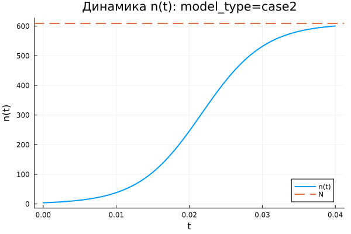
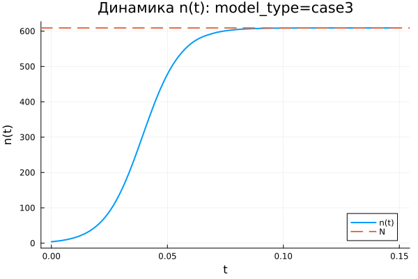

---
## Author
author:
  name: Гафоров Нурмухаммад
  email: 1032234484@rudn.ru
  affiliation:
    - name: Российский университет дружбы народов
      country: Российская Федерация
      postal-code: 117198
      city: Москва
      address: ул. Миклухо-Маклая, д. 6

## Title
title: "Математическое моделирование"
subtitle: "Лабораторная работа № 6"
license: "CC BY"
---

# Цель работы

Исследовать математическую модель, описывающую эффективность рекламной кампании.

# Задание

1. Изучить модель эффективности рекламы.
2. Построить графики распространения рекламы для заданных случаев.
3. Для второго случая определить момент времени, при котором скорость распространения рекламы принимает максимальное значение.

# Выполнение лабораторной работы

## Теоретические сведения

# Выполнение лабораторной работы

## Теоретические сведения

Рекламная кампания нового товара или услуги направлена на увеличение числа потенциальных покупателей, знающих о продукте и готовых его приобрести. При этом ожидаемая прибыль от будущих продаж должна превышать затраты на рекламу. На начальном этапе расходы могут быть выше дохода, поскольку о товаре знает лишь малая часть аудитории. Затем число информированных покупателей растёт, продажи увеличиваются, прибыль возрастает. После достижения насыщения рынка дальнейшее рекламирование теряет эффективность.

Пусть торговая сеть реализует некоторую продукцию. В момент времени $t$ из общего числа потенциальных покупателей $N$ о товаре знают $n$ человек. Для ускорения продаж запускается реклама через радио, телевидение и другие каналы массовой информации. После начала рекламной кампании сведения о товаре распространяются не только через официальные объявления, но и через общение покупателей между собой. Поэтому скорость роста числа информированных людей зависит от числа уже осведомлённых покупателей и от числа покупателей, которые ещё не знают о товаре.

Модель рекламной кампании задаётся следующими величинами.

Считаем, что $\frac{dn}{dt}$ обозначает скорость изменения числа потребителей, узнавших о товаре и готовых его купить; $t$ — время, прошедшее с начала рекламной кампании; $N$ — общее количество потенциальных платёжеспособных покупателей; $n(t)$ — число уже информированных клиентов.

Вклад прямой рекламы пропорционален числу покупателей, которые ещё не знают о товаре. Его можно записать в виде $\alpha_1(t)(N-n(t))$, где $\alpha_1(t)>0$ характеризует интенсивность рекламной кампании и зависит от текущих затрат на продвижение.

Кроме прямой рекламы, информацию распространяют сами покупатели. Этот механизм соответствует «сарафанному радио» и описывается выражением $\alpha_2(t)n(t)(N-n(t))$. Чем больше людей уже знает о товаре, тем сильнее становится этот канал распространения информации.

Математическая модель распространения рекламы имеет вид:

$$
\frac{dn}{dt} = (\alpha_1(t) + \alpha_2(t)n(t))(N-n(t)).
$$

При $\alpha_1(t) >> \alpha_2(t)$ модель приближается к модели Мальтуса. Её решение имеет следующий характер:

{ #fig:001 width=70% height=70% }

Если $\alpha_1(t) << \alpha_2(t)$, то основную роль играет нелинейный механизм распространения информации, и уравнение приводит к логистической кривой:

{ #fig:002 width=70% height=70% }

## Задача

Построить графики распространения рекламы для моделей, заданных уравнениями:

1. $\frac{dn}{dt} = (0.54 + 0.00016n(t))(N-n(t))$
2. $\frac{dn}{dt} = (0.000021 + 0.38n(t))(N-n(t))$
3. $\frac{dn}{dt} = (0.2\cos{t} + 0.2\cos{2t}n(t))(N-n(t))$

Объём потенциальной аудитории равен $N = 609$. В начальный момент времени о товаре знают $4$ человека.

Для второго случая требуется найти момент времени, в который скорость распространения рекламы достигает максимума.

Для моделирования процесса и построения графиков использовались внешние файлы с программным кодом:





## Базовые эксперименты

### Первая модель (model_type = case1)

В первой модели значение $n(t)$ растёт монотонно. В начале процесса число информированных покупателей мало по сравнению с предельным уровнем $N = 609$, поэтому прирост происходит интенсивно. Затем по мере приближения $n(t)$ к уровню насыщения рост постепенно замедляется.

На графике динамики видно, что к концу расчётного интервала $t \in [0; 10]$ решение почти достигает значения $N$. Горизонтальная пунктирная линия показывает уровень насыщения, к которому стремится численное решение. Переменная $n(t)$ не выходит за верхний предел, а плавно приближается к нему снизу.

График скорости изменения показывает, что наибольшее значение $\frac{dn}{dt}$ наблюдается в начальный момент времени. Затем скорость монотонно уменьшается и стремится к нулю. Следовательно, основной прирост числа информированных покупателей происходит в начале процесса, после чего система постепенно переходит к насыщению.

Фазовая траектория $\frac{dn}{dt}(n)$ подтверждает этот вывод. При малых значениях $n$ скорость изменения максимальна, а при приближении к $N$ она уменьшается почти до нуля. Траектория убывает, поэтому модель описывает быстрый начальный рост с последующим замедлением.

Первая модель демонстрирует устойчивое стремление к предельному уровню $N$. Состояние $n = N$ является равновесным, поскольку при достижении насыщения множитель $(N-n)$ обращает правую часть уравнения в ноль.

### Вторая модель (model_type = case2)

Во второй модели величина $n(t)$ увеличивается значительно быстрее, чем в первой. Расчёт ведётся на коротком интервале $t \in [0; 0{,}04]$, однако за это время решение почти достигает уровня $N = 609$. Быстрый рост объясняется большим значением коэффициента $b$, усиливающего вклад слагаемого $bn$.

График $n(t)$ имеет выраженную S-образную форму. В начале процесс развивается сравнительно медленно, потому что значение $n$ ещё невелико. Затем скорость резко возрастает. После этого рост снова замедляется из-за приближения к предельному уровню $N$.

График $\frac{dn}{dt}$ содержит один ярко выраженный максимум. Сначала скорость изменения увеличивается, затем достигает пикового значения в активной фазе распространения рекламы, после чего быстро уменьшается почти до нуля. Это показывает, что модель описывает ускоренный рост с последующим торможением за счёт ограничивающего множителя $(N-n)$.

Фазовая траектория $\frac{dn}{dt}(n)$ имеет форму, близкую к параболической. При малых значениях $n$ скорость невелика, затем она растёт и достигает максимума примерно при $n \approx 300$, после чего уменьшается при движении к $N$. Эта форма отражает взаимодействие двух факторов: самоускорения за счёт множителя $bn$ и ограничения за счёт множителя $(N-n)$.

Вторая модель описывает наиболее резкий переход к насыщению. В отличие от первой модели, максимальная скорость достигается не в начальный момент, а внутри траектории, когда число информированных покупателей уже заметно выросло, но запас до уровня $N$ ещё остаётся большим.

### Третья модель (model_type = case3)

В третьей модели величина $n(t)$ также монотонно возрастает и быстро приближается к уровню $N = 609$. На графике видно, что основная часть роста приходится на начальный участок интервала $t \in [0; 0{,}15]$. После этого кривая почти совпадает с горизонтальным уровнем насыщения.

Особенность третьей модели состоит в наличии периодических множителей $\cos(t)$ и $\cos(2t)$. На выбранном коротком интервале эти функции остаются положительными и близкими к единице, поэтому они не создают заметных колебаний решения, а лишь меняют интенсивность роста.

График скорости $\frac{dn}{dt}$ имеет один выраженный пик. В начале процесса скорость увеличивается, затем достигает максимума, после чего быстро уменьшается к нулю. После выхода $n(t)$ на уровень насыщения дальнейшее изменение практически прекращается.

Фазовая траектория $\frac{dn}{dt}(n)$ по форме близка к параболе. Скорость изменения мала при небольших значениях $n$, затем возрастает и достигает максимума примерно в средней части диапазона. При приближении к $N$ множитель $(N-n)$ снижает скорость почти до нуля.

Третья модель показывает насыщаемый рост с коэффициентами, зависящими от времени. На рассмотренном интервале периодические множители не меняют общий характер процесса: решение остаётся монотонным, достигает предельного уровня и переходит в равновесное состояние.

## Сравнение базовых экспериментов

Во всех трёх моделях величина $n(t)$ стремится к одному и тому же предельному уровню $N = 609$. Причина состоит в наличии множителя $(N-n)$, который снижает скорость роста при приближении к насыщению и обращает её в ноль при $n = N$.

Первая модель характеризуется быстрым начальным ростом и дальнейшим плавным замедлением. Максимальная скорость наблюдается в начале процесса, а фазовая траектория убывает.

Вторая модель демонстрирует наиболее резкий S-образный рост. Скорость сначала увеличивается, затем достигает максимума и после этого уменьшается. Фазовая траектория имеет выраженную параболическую форму, что указывает на наличие внутренней точки максимального роста.

Третья модель по характеру близка ко второй, но использует коэффициенты, зависящие от времени. На рассматриваемом интервале эта зависимость не приводит к колебательному режиму, поскольку значения $\cos(t)$ и $\cos(2t)$ остаются положительными.

Все три модели приводят систему к насыщению, но различаются скоростью перехода к предельному состоянию и характером изменения производной $\frac{dn}{dt}$.

## Параметрическое сканирование

### Зависимость итогового значения $n$ от параметра $a$

На графике представлена зависимость итогового значения $n_{final}$ от параметра $a$ для трёх моделей. Большинство точек располагается около уровня $N = 609$, что указывает на почти полное насыщение к концу расчётного интервала.

Для первой модели значения $n_{final}$ близки к $N$ при всех рассмотренных значениях параметра $a$. Следовательно, изменение $a$ в выбранном диапазоне не нарушает общий характер процесса: решение продолжает стремиться к предельному уровню.

Во второй модели заметен один выброс при малом значении $a$. В этом эксперименте итоговое значение $n$ значительно ниже $N$ и составляет примерно $n_{final} \approx 455$. Это связано с тем, что при выбранной комбинации параметров процесс не успевает выйти на насыщение за короткое время моделирования.

Для третьей модели значения $n_{final}$ также расположены в верхней части графика и близки к $N$. Периодические коэффициенты при выбранных параметрах не приводят к заметному снижению итогового уровня.

Параметр $a$ влияет не только на итоговое значение, но и на скорость выхода к насыщению. При низкой интенсивности роста система может не успеть достичь уровня $N$ за заданный интервал расчёта.

### Зависимость итогового значения $n$ от параметра $b$

График зависимости $n_{final}$ от параметра $b$ показывает, что в большей части экспериментов итоговое значение находится около $N = 609$. Это подтверждает устойчивое стремление решений к насыщению.

Для первой модели точки сгруппированы около малых значений $b$, поскольку при параметрическом сканировании использовались небольшие значения этого коэффициента. Несмотря на это, итоговые значения $n$ остаются близкими к предельному уровню.

Во второй модели влияние параметра $b$ выражено сильнее. При одном из значений $b$ итоговое значение $n$ заметно ниже уровня насыщения. Это означает, что для соответствующей комбинации параметров рост оказался недостаточно быстрым, и система не успела приблизиться к $N$ за расчётное время.

Для третьей модели точки находятся около $N$, что указывает на сохранение режима насыщаемого роста. Даже при наличии множителей $\cos(t)$ и $\cos(2t)$ итоговое значение остаётся близким к верхнему пределу.

График показывает, что параметр $b$ особенно важен в моделях с нелинейным усилением роста через слагаемое $bn$. При малом значении коэффициента выход на насыщение может замедляться.

### Зависимость максимального значения $n$ от параметра $a$

На графике показана зависимость максимального значения $n_{max}$ от параметра $a$. Поскольку во всех базовых экспериментах функция $n(t)$ возрастает монотонно, величина $n_{max}$ практически совпадает с итоговым значением $n_{final}$.

Для первой модели максимальные значения находятся около уровня $N = 609$. Это означает, что решение достигает верхней границы или подходит к ней достаточно близко.

Во второй модели снова выделяется точка с меньшим значением $n_{max}$. На всём временном интервале решение не смогло приблизиться к насыщению. Причина связана не с изменением направления динамики, а с недостаточной скоростью роста на выбранном интервале времени.

Для третьей модели максимальные значения сохраняются около $N$. Следовательно, коэффициенты, зависящие от времени, не мешают достижению высокого уровня $n$ при выбранном диапазоне параметров.

Поскольку $n_{max}$ отражает наибольшее значение решения за время расчёта, этот график подтверждает выводы, полученные при анализе $n_{final}$.

### Зависимость максимального значения $n$ от параметра $b$

График зависимости $n_{max}$ от параметра $b$ близок по структуре к графику $n_{final}(b)$. Это связано с монотонным ростом решений: максимум достигается в конце расчётного интервала или рядом с ним.

Для первой модели значения $n_{max}$ сосредоточены около $N$. Изменение параметра $b$ в малом диапазоне не приводит к заметному снижению максимального уровня.

Во второй модели одна точка располагается значительно ниже остальных. Это показывает, что при соответствующей комбинации параметров модель не выходит на насыщение. Остальные эксперименты для второй модели дают значения около верхнего предела.

Для третьей модели все точки остаются вблизи $N$, что говорит о стабильном достижении насыщения. Параметр $b$ влияет на скорость роста, но в проведённых экспериментах не меняет конечный характер динамики.

График подтверждает, что максимальный уровень $n$ ограничивается величиной $N$, а параметры $a$ и $b$ определяют скорость приближения к этому пределу.

### Зависимость финального насыщения от параметра $a$

На графике представлена зависимость относительного итогового насыщения $\frac{n_{final}}{N}$ от параметра $a$. Значение, близкое к $1$, соответствует почти полному достижению предельного уровня $N$.

Для первой модели насыщение находится около $1$ при всех рассмотренных значениях $a$. Это показывает, что модель стабильно выходит к предельному состоянию.

Во второй модели наблюдается одна точка с насыщением около $0{,}75$. В этом случае итоговое значение составляет примерно три четверти от возможного максимума. Остальные точки располагаются значительно выше и находятся рядом с полным насыщением.

Для третьей модели значения $\frac{n_{final}}{N}$ находятся вблизи $1$. Это указывает на почти полное насыщение даже при наличии временной зависимости коэффициентов.

График удобен для сравнения моделей, поскольку нормировка на $N$ позволяет оценивать не абсолютное значение $n$, а степень приближения к верхнему пределу.

### Зависимость финального насыщения от параметра $b$

График зависимости $\frac{n_{final}}{N}$ от параметра $b$ показывает, что большинство экспериментов завершается почти полным насыщением. Значения расположены около $1$, что соответствует достижению уровня $N$.

Для первой модели насыщение остаётся высоким при всех рассмотренных значениях $b$. Даже малые значения параметра не мешают решению приблизиться к предельному уровню за выбранное время.

Во второй модели снова появляется одно пониженное значение. В этом эксперименте система достигает только около $75\%$ от уровня $N$. Этот результат показывает чувствительность второй модели к сочетанию параметров и длине расчётного интервала.

Для третьей модели точки располагаются около полного насыщения. Временные множители не создают заметного снижения итогового уровня.

График подтверждает стремление системы к насыщению. При отдельных наборах параметров время моделирования может оказаться недостаточным для выхода на уровень $N$.

## Бенчмаркинг

### Зависимость времени решения ODE от параметра $a$

На графике показано медианное время численного решения задачи ОДУ при различных значениях параметра $a$. Время вычислений находится примерно в диапазоне от $3{,}45 \cdot 10^{-5}$ до $3{,}95 \cdot 10^{-5}$ секунды.

Для всех трёх моделей значения времени близки друг к другу. Это означает, что рассмотренные задачи имеют малую вычислительную сложность, а изменение параметров не вызывает резкого роста затрат на интегрирование.

Явная монотонная зависимость времени решения от параметра $a$ не проявляется. Точки располагаются с небольшим разбросом, который может быть связан с особенностями работы численного метода, кэшированием, системной нагрузкой и погрешностью измерения при малых временах выполнения.

Третья модель в отдельных точках требует немного больше времени. Вероятная причина состоит в более сложной правой части уравнения, где дополнительно вычисляются функции $\cos(t)$ и $\cos(2t)$.

Бенчмаркинг показывает, что все три модели решаются быстро, а различия между ними по времени вычислений остаются небольшими.

### Зависимость времени решения ODE от параметра $b$

На графике представлена зависимость времени решения ОДУ от параметра $b$. Как и для параметра $a$, значения времени находятся в узком диапазоне порядка $10^{-5}$ секунды.

Для первой модели точки сосредоточены около малых значений $b$, что соответствует выбранной сетке параметров. Время решения немного колеблется, но устойчивый рост или спад не наблюдается.

Для второй модели значения времени также меняются с небольшим разбросом. Даже при увеличении $b$ вычислительные затраты не возрастают существенно. Это говорит о том, что выбранный решатель справляется с задачей без заметного усложнения интегрирования.

Для третьей модели часть точек располагается выше, чем у первых двух моделей. Вероятная причина заключается в более сложной формуле правой части, содержащей тригонометрические множители. При этом различие остаётся небольшим и не меняет общий вывод о высокой скорости расчёта.

График показывает, что параметр $b$ сильнее влияет на динамику решения, чем на время вычислений. В рамках проведённого сканирования вычислительная стоимость остаётся стабильной для всех трёх моделей.

## Выводы

1. Первая модель (case1) описывает насыщаемый рост величины $n(t)$. Решение монотонно увеличивается и постепенно приближается к предельному уровню $N = 609$, не превышая его.

2. Во второй модели (case2) наблюдается наиболее резкий рост. Функция $n(t)$ имеет выраженную S-образную форму: сначала рост идёт медленно, затем ускоряется, после чего замедляется при приближении к уровню насыщения.

3. Третья модель (case3) также приводит систему к насыщению, но отличается коэффициентами, зависящими от времени: $\cos(t)$ и $\cos(2t)$. На выбранном интервале они не вызывают колебаний, поэтому решение остаётся монотонным.

4. Во всех трёх моделях предельное значение $N$ задаёт уровень насыщения. При приближении $n(t)$ к $N$ множитель $(N-n)$ уменьшает скорость роста, а при $n = N$ правая часть уравнения становится равной нулю.

5. Графики скорости изменения $\frac{dn}{dt}$ показывают различие между моделями. В первой модели скорость максимальна в начальный момент и затем монотонно уменьшается. Во второй и третьей моделях скорость сначала возрастает, достигает максимума, а затем снижается почти до нуля.

6. Фазовые траектории $\frac{dn}{dt}(n)$ подтверждают характер динамики. Для первой модели траектория убывает, а для второй и третьей моделей имеет форму, близкую к параболической, с внутренней точкой максимальной скорости роста.

7. Параметры $a$ и $b$ в первую очередь влияют на скорость выхода к насыщению. При достаточно больших значениях параметров система быстро достигает уровня $N$, а при отдельных комбинациях, особенно во второй модели, решение не успевает полностью выйти на насыщение за заданное время.

8. Метрики $n_{final}$ и $n_{max}$ в большинстве экспериментов близки к $N = 609$, что указывает на достижение предельного состояния. Заметные отклонения связаны не с изменением направления динамики, а с недостаточной длительностью расчётного интервала для некоторых наборов параметров.

9. Метрика $\text{saturation\_final} = \frac{n_{final}}{N}$ позволяет оценить степень достижения насыщения. Значения, близкие к единице, показывают почти полный выход системы на предельный уровень, а пониженные значения указывают на незавершённый переходный процесс.

10. Бенчмаркинг показал, что численное решение всех трёх моделей выполняется быстро. Время вычислений имеет порядок $10^{-5}$ секунды, а изменение параметров $a$ и $b$ почти не влияет на вычислительные затраты.

11. Третья модель немного сложнее с вычислительной точки зрения, поскольку правая часть содержит тригонометрические функции. Однако разница во времени решения остаётся небольшой и не влияет существенно на общую эффективность расчётов.

12. Все три модели описывают процесс насыщаемого роста, но различаются скоростью перехода к предельному состоянию и формой зависимости $\frac{dn}{dt}$ от времени и значения $n$.

# Список литературы {.unnumbered}

1. [Модель Мальтуса](http://km.mmf.bsu.by/courses/2018/mathmod1/MM_LB1_Population_2019.pdf)
2. [Логистическая модель роста](https://studopedia.ru/29_5129_logisticheskaya-model-rosta.html)
